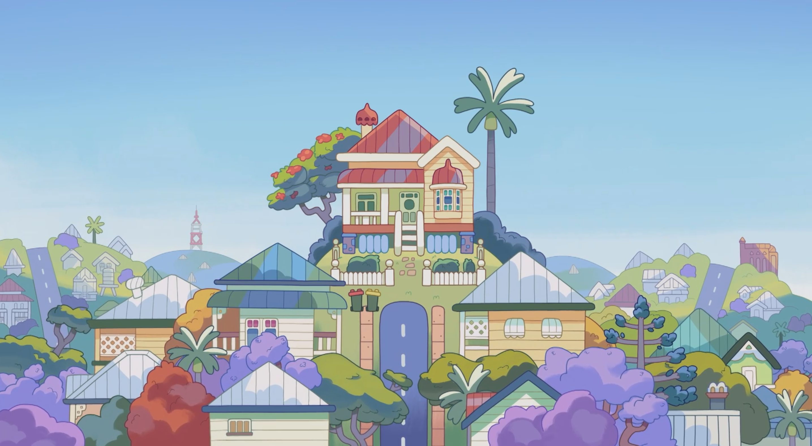

<!-- 第一幅图：布鲁伊 -->
<div align="center">
  
</div>
<!-- profile logo 个人资料徽标 -->
  <div>
    <a href="https://mp.weixin.qq.com/s/_dIPYz4jh5mSzV-q55fn7g"></a>&emsp;
    &emsp;
  </div>
  
# 🌟 Hello！Cheeky dog ！~~ 👋


## 📚 About Me

- 🔭 **Current Focus**: Pursuing a Master's degree in Polymer Materials and Computational Chemistry at **Beijing Institute of Technology**.
- 🎓 **Undergraduate**: Bachelor's degree in Applied Physics with a minor in Artificial Intelligence (**Double Major**) from **Beijing Institute of Technology**.
- 💻 **Skills**: Proficient in Web Frontend Development and Machine Learning.
- ❤️ **Hobbies**: Big fan of **Bluey** (as you can see above)! 🐶

---

## 🏆 Skills & Interests

### Programming Languages & Tools
```bash
Python  |  JavaScript  |  HTML/CSS  |  React  |  TensorFlow  |  Pytorch  |  MySQL
```

### Research Areas
- Polymer Materials
- Computational Chemistry
- Machine Learning Applications in Chemistry

---

## 📊 GitHub Stats

<!-- metrics 基础资料 -->


---

<!-- GitHub Activity Graph - GitHub 活动图 -->
<table>
  <tr>
    <td>
      <picture>
        <!-- Dark Mode 图表 -->
        <source media="(prefers-color-scheme: dark)" srcset="https://github-readme-activity-graph.vercel.app/graph?username=crashbussy&theme=tokyo-night" />
        <!-- Light Mode 图表 -->
        <source media="(prefers-color-scheme: light)" srcset="https://github-readme-activity-graph.vercel.app/graph?username=crashbussy&theme=xcode" />
        <!-- 默认显示（Dark Mode） -->
        
      </picture>
    </td>
  </tr>
</table>

<!-- Profile 3D Contribution Graph - 3D 贡献图 -->
<picture>
  <source media="(prefers-color-scheme: dark)" srcset="/profile-3d-contrib/profile-night-rainbow.svg" />
  <source media="(prefers-color-scheme: light)" srcset="/profile-3d-contrib/profile-gitblock.svg" />
  
</picture>

---

## 🐶 Why I Love **Bluey** (And You Should Too!)

### 1. **Excellent educational methods**
Bluey is an animated series that benefits both parents and children alike. Through the everyday life of the Bluey family, it demonstrates how to educate children through play and interaction.
Bluey's parents (Bandit and Chilli) always treat their children as equals, respecting their ideas and encouraging them to try new things. Whether through role-playing games or small challenges in daily life, they show how to nurture creativity, responsibility, and empathy in a relaxed and enjoyable atmosphere. This is something truly worth learning from in modern family education!
In the process of raising their children, the parents are also growing themselves. 

> **Recommended Episode**: **"Bluey S03E13 - Housework**。


### 2. **How to Live in the Present: Coping with Life Stress**

Bandit is a character that we commonly see having fun being carefree and being constantly attentive to his children however in one of the newerepisodes of Bluey stick bird, we only see the opposite.

> **Recommended Episode**: **Bluey S03E41 - Stickbird**

---

## 🌟 My Favorite Moment from Bluey
<!-- 使用 HTML 调整图片大小 -->


The most touching moment ❤️

---

## ⭐ Support

If you find my work helpful, please consider giving this repository a ⭐. It means a lot! 😊
